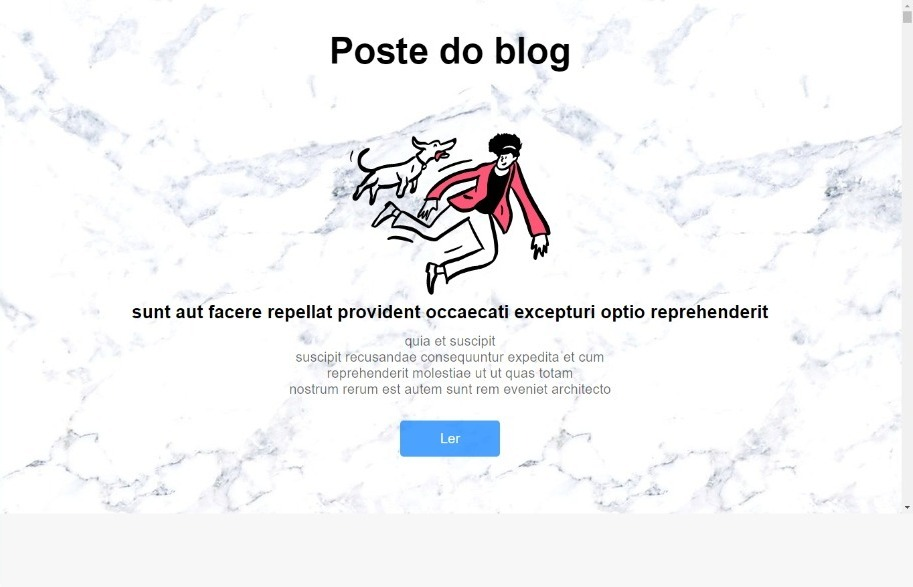

# Esse site foi desenvolvido com objetivo de expandir meus conhecimentos !

> Desenvolvido com a API: https://my-json-server.typicode.com/

## Linguagens utilizadas no projeto:
> Html
 
> Css
 
> JavaScript

## O que fazer dentro do projeto ?
> No projeto clicando no botao "Ler" na pagina inicial, é possivel fazer comentarios que são adicionados ao fim da pagina.

___
### Baixe os arquivos em sua maquina e execute o projeto para visualiza-lo.